# Governed Banking Intent Router

A Mac-first research implementation of a privacy-aware banking support router. The system uses
LoRA-adapted RoBERTa as one component in a larger decision pipeline that includes calibration,
uncertainty handling, deterministic escalation and metadata-only audit events.

> **Status: Module 11 verifies CPU and native Mac MPS execution. CUDA support is implemented but
> remains unverified until the registered Colab notebook runs on a real NVIDIA GPU. Module 8
> uncertainty gates remain failed and no automated route is production approved.**



## Problem

Customer-support teams must route short and often ambiguous messages. A closed-set classifier will
always choose one of its known labels, even when a request is unfamiliar, contains multiple issues
or requires urgent security review. Optimising average accuracy alone does not make that behaviour
safe.

This project evaluates a more defensible design:

1. redact structured personal information before model inference;
2. classify the redacted request with LoRA-RoBERTa;
3. calibrate probabilities on validation data;
4. compute uncertainty and possible out-of-distribution signals;
5. apply a versioned, deterministic routing policy;
6. record decision metadata without retaining the customer message.

The service recommends a queue. It never moves money, freezes an account, approves a payment,
authenticates a customer or provides financial advice.

## Current module

Module 11 adds strict `auto`, `cuda`, `mps` and `cpu` execution profiles without modifying Module
10's historical MPS files. `auto` selects CUDA, then MPS, then CPU. Every explicit profile fails if
its requested backend is unavailable; CUDA is never simulated and MPS operator fallback to CPU is
prohibited in registered evidence runs.

The same pinned seed-42 adapter can now produce metadata-only prediction reports on MPS and CUDA.
The comparison requires identical top-1 intents and deterministic routing actions plus a maximum
absolute probability difference of 0.001. It uses the existing 12-case synthetic service fixture,
not BANKING77 test data or customer data. These checks concern execution parity, not model quality.

The service remains in `shadow_review_only` mode. It may return `security_queue` or `human_review`,
but its schema cannot return `suggest_queue`. Module 8 thresholds are experimental observations
only and cannot authorize automation.

Run the local checks:

```bash
source .venv/bin/activate
python -m pip install -e ".[dev,notebook]"
ruff check .
pytest --cov=governed_banking --cov-report=term-missing
```

Reproduce the verified native-Mac reference:

```bash
python scripts/verify_accelerator.py \
  --profile configs/runtime/mps.yaml \
  --report reports/runtime/mps-runtime.json
python scripts/run_backend_parity.py \
  --backend mps \
  --report reports/parity/mps-seed42.json
```

Then use
[`11b-google-colab-cuda-prediction-parity.ipynb`](output/jupyter-notebook/11b-google-colab-cuda-prediction-parity.ipynb)
on a real Colab GPU. It restores only the exact hash-bound private adapter, downloads the pinned
public RoBERTa revision, creates CUDA evidence and applies the preregistered parity gates. The CUDA
and cross-device reports must not be claimed until that notebook passes.

Reproduce the Module 10 real-MPS integration evidence:

```bash
python scripts/run_service_evaluation.py
```

Then open
[`10-shadow-fastapi-mps-evaluation.ipynb`](output/jupyter-notebook/10-shadow-fastapi-mps-evaluation.ipynb)
in VS Code and run it with the project virtual environment's `Python 3` kernel.

Start the local API with a fresh development token:

```bash
export GOVERNED_BANKING_API_TOKEN="$(openssl rand -hex 32)"
python scripts/run_api.py
```

The service binds only to `127.0.0.1:8000`. In another terminal, submit a synthetic request:

```bash
curl --request POST http://127.0.0.1:8000/v1/route \
  --header "Authorization: Bearer $GOVERNED_BANKING_API_TOKEN" \
  --header "Content-Type: application/json" \
  --data '{"message":"When will my replacement card arrive?"}'
```

## Verified Module 11 local execution evidence

| Measure | Registered result |
|---|---:|
| Explicit CPU tensor probe | Pass |
| Explicit MPS tensor probe | Pass — Apple M4 |
| MPS prediction cases | 12/12 completed |
| Input or redacted text persisted | No |
| Official test or customer data accessed | No |
| Explicit CUDA request on the Mac | Failed closed; no fallback |
| Real CUDA prediction evidence | **Pending Colab execution** |
| MPS–CUDA parity decision | **Not yet available** |

The MPS reference is bound to the runtime profile, service configuration, fixture, privacy policy,
routing policy, calibration report, checkpoint files and implementation hashes. See the
[cross-platform accelerator decision](docs/decisions/0002-cross-platform-accelerators.md).

## Verified Module 10 local integration evidence

| Measure | Registered result |
|---|---:|
| Runtime | Apple MPS |
| Model/API startup | 0.9031 seconds |
| Measured sequential requests | 36/36 HTTP 200 |
| Mean / p50 / p95 latency | 67.00 / 13.34 / 299.25 ms |
| Registered p95 maximum | 750 ms — pass |
| Metadata-only audit events | 39/39 validated |
| Security-boundary checks | 7/7 passed |
| Original or redacted value matches | 0 |
| `suggest_queue` actions | 0 |

The latency run used an in-process client on one Mac and included inference, routing and an
`fsync`-backed local audit append. It is not a throughput test or service-level objective. See the
[Module 10 service boundary](docs/SERVICE_BOUNDARY.md).

## Verified Module 9 control evidence

| Control | Registered synthetic result |
|---|---:|
| PII cases | 23/23 matched expected output |
| Registered PII detector classes exercised | 11/11 |
| Routing safety cases | 8/8 matched expected action and queue |
| Metadata-only audit events round-tripped | 24/24 |
| Original or redacted message values found in audit serialization | 0 |
| `suggest_queue` actions | 0 |
| Local audit directory/file modes | `0700` / `0600` |

These results verify code behaviour only against the versioned fixtures. The recognizers do not
detect free-form names or all contextual identifiers, and the local JSONL sink is not a production
logging platform. See the [privacy and audit card](docs/PRIVACY_AUDIT_CARD.md) and
[deterministic routing policy](docs/RISK_ROUTING_POLICY.md).

## Verified Module 8 assessment evidence

The selected signal and threshold differ by seed because selection was performed independently on
each seed's development roles. None may be changed after assessment.

| Seed | Selected signal | Known coverage | Selective risk | Synthetic possible-OOD recall | AUROC | Gate |
|---:|---|---:|---:|---:|---:|---|
| 17 | Inverse normalized entropy | 0.9200 | 0.0609 | 0.8542 | 0.9546 | Fail |
| 42 | Maximum probability | 0.9362 | 0.0597 | 0.8750 | 0.9586 | Fail |
| 73 | Inverse normalized entropy | 0.8827 | 0.0725 | 0.9375 | 0.9699 | Fail |
| **Mean** | — | **0.9129** | **0.0643** | **0.8889** | **0.9611** | **Fail** |

The ranking result is strong but operational performance is insufficient. AUROC around 0.96 does
not imply a safe threshold: seeds 17 and 42 missed the 90% synthetic possible-OOD recall target,
and every seed exceeded the 5% selective-risk ceiling. Public-services and shopping/delivery
requests were recurring false accepts. See the
[uncertainty and possible-OOD card](docs/UNCERTAINTY_OOD_CARD.md).

## Verified Module 7 calibration evidence

Metrics below use only each seed's held-out `calibration_assessment` rows. Lower is better.

| Seed | Temperature | Assessment rows | ECE raw → scaled | NLL raw → scaled | Brier raw → scaled |
|---:|---:|---:|---:|---:|---:|
| 17 | 0.8285 | 750 | 0.0555 → 0.0334 | 0.3378 → 0.3234 | 0.1354 → 0.1317 |
| 42 | 0.8910 | 751 | 0.0463 → 0.0265 | 0.3216 → 0.3090 | 0.1404 → 0.1375 |
| 73 | 0.8924 | 750 | 0.0391 → 0.0242 | 0.3926 → 0.3846 | 0.1611 → 0.1589 |
| **Mean** | **0.8706** | — | **0.0470 → 0.0280** | **0.3507 → 0.3390** | **0.1456 → 0.1427** |

All registered point-estimate gates passed and zero assessment predictions changed. Paired
bootstrap intervals support lower NLL and Brier score for every seed. The seed-73 interval for the
ECE change crosses zero, however, and maximum calibration error is unstable in sparsely populated
bins. The credible conclusion is therefore narrower than “the model is calibrated”: scalar
temperature scaling improved several assessment-set probability-quality measures in this
post-selection experiment. See the [calibration card](docs/CALIBRATION_CARD.md).

## Verified Module 6 validation evidence

| Seed | Best epoch | Best validation macro-F1 |
|---:|---:|---:|
| 17 | 8 | 0.9006 |
| 42 | 8 | 0.9026 |
| 73 | 6 | 0.8890 |
| **Mean ± sample SD** | — | **0.8974 ± 0.0073** |

These values describe validation behaviour only. They cannot be compared with Module 5's official
test result as evidence of improved generalisation. Seeds 17 and 42 still peaked at the eight-epoch
boundary, so full convergence is not established. See the
[multi-seed exploratory card](docs/MULTISEED_EXPLORATORY_CARD.md).

## Verified Module 5 comparison

Both models were evaluated on the same 3,080 official test rows:

| Metric | TF-IDF | Frozen RoBERTa | LoRA RoBERTa |
|---|---:|---:|---:|
| Accuracy | **0.9052** | 0.8961 | 0.8273 |
| Macro-F1 | **0.9053** | 0.8964 | 0.8202 |
| Weighted-F1 | **0.9053** | 0.8964 | 0.8202 |
| Log-loss | 0.4970 | **0.3990** | 0.7746 |
| Top-3 accuracy | 0.9705 | **0.9718** | 0.9497 |

Frozen RoBERTa corrected 135 rows missed by TF-IDF, while TF-IDF corrected 163 rows missed by
RoBERTa. Their paired exact McNemar p-value is 0.1177, which does not establish equivalence. The
results suggest complementarity, but not that generic frozen embeddings beat the lexical baseline.

The rank-8 LoRA candidate trained 944,717 parameters (0.7519%) and won validation, but finished
0.0851 macro-F1 below TF-IDF and 0.0762 below frozen RoBERTa. Its validation curve improved in every
epoch, so the defensible conclusion is that this registered protocol underfit—not that LoRA is
generally inferior. Its Module 5 probabilities were uncalibrated; Module 7 later evaluated scalar
temperature scaling on the revised multi-seed checkpoints. See the
[LoRA baseline card](docs/LORA_BASELINE_CARD.md).

## Evidence contract

- The official test split is not used for training, checkpoint selection, calibration or threshold
  selection.
- Model comparisons use the same data policy and report seeds 17, 42 and 73.
- Public results include macro-F1, per-intent failures, calibration and risk-coverage behaviour.
- Synthetic unknown-request tests are identified as synthetic and not presented as production
  evidence.
- Unverified results are never promoted from notebooks into the README.

See the [data card](docs/DATA_CARD.md), [system boundary](docs/SYSTEM_BOUNDARY.md) and
[evaluation protocol](docs/EVALUATION_PROTOCOL.md).

## Planned modules

1. Mac/MPS foundation and evaluation contract - **complete**
2. Immutable BANKING77 loader and split-integrity tests - **complete**
3. TF-IDF logistic-regression baseline - **complete**
4. Frozen RoBERTa embedding baseline - **complete**
6. Multi-seed manifests, revised development protocol and aggregation - **complete; exploratory**
7. Temperature scaling and calibration assessment - **complete; exploratory**
8. Uncertainty, selective prediction and possible-OOD evaluation - **complete; gates failed**
9. PII controls, risk policy and metadata-only auditing - **complete; synthetic control evidence**
10. FastAPI service and local MPS integration evidence - **complete; production release prohibited**
11. Cross-platform runtime and prediction parity - **MPS/CPU verified; real CUDA run pending**

## Responsible-use limitations

- BANKING77 is a public benchmark, not representative bank traffic.
- Confidence and entropy do not prove that a request is in distribution.
- Regex-based PII redaction cannot identify every contextual identifier.
- Banking operations, fraud, privacy and compliance specialists must review any real deployment.

## Licence

Project code is released under the [MIT License](LICENSE). The pinned RoBERTa model and BANKING77
dataset have separate upstream terms and attribution requirements. See
[Third-party notices](THIRD_PARTY_NOTICES.md) before redistributing data, model files or adapters.

Before publishing a release, run the repository's
[publication-hygiene check](docs/PUBLICATION_HYGIENE.md) to detect machine-specific paths,
credential signatures and accidentally tracked runtime artifacts.
