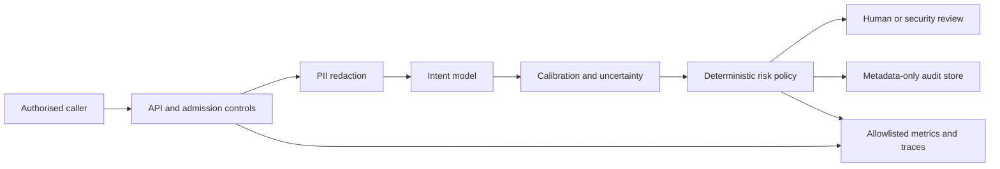

# Architecture

| Attribute | Value |
|---|---|
| Status | Research preview; production use prohibited |
| Operating mode | `shadow_review_only` |
| Accountable organisation | INNETWORK Technology Limited |
| Current champion | `tfidf-word-char-c4` |
| Shadow service model | `lora-roberta-r8-revised` |
| Decision authority | Human reviewer |

## Purpose and boundary

The system evaluates governed routing patterns for short English banking-support messages. It may
recommend `human_review` or `security_queue`; it cannot execute a queue change or any banking
action. The model prediction is evidence supplied to a deterministic policy, not the final
decision.

In scope:

- public BANKING77 and explicitly labelled synthetic research data;
- structured-PII redaction before inference;
- intent classification, calibration and diagnostic uncertainty signals;
- deterministic risk-routing rules;
- authenticated research APIs, metadata-only audit events and privacy-safe telemetry; and
- native macOS MPS plus Linux CPU/CUDA deployment contracts.

Out of scope:

- transactions, account restrictions, identity decisions or fraud determinations;
- financial, legal or regulatory advice;
- direct internet exposure or autonomous customer routing;
- real customer data, automatic feedback ingestion or automatic retraining; and
- production-readiness or compliance claims based on benchmark results.

## System context

The caller, gateway, service process, model artifacts, audit store and telemetry backend are
separate trust boundaries. Production identity, storage and telemetry services are not supplied by
this repository.

## Components

| Component | Responsibility | Primary implementation |
|---|---|---|
| API boundary | Host, authentication, schema and body-size validation | `api.py`, `deployment_service.py` |
| Privacy control | Detect and replace registered structured identifiers before inference | `privacy.py`, `configs/privacy.yaml` |
| Predictor | Produce intent probabilities from redacted text | `portable_inference.py` |
| Calibration | Apply the registered scalar temperature | `calibration.py` |
| Uncertainty | Produce diagnostic confidence, margin or entropy observations | `uncertainty.py` |
| Routing policy | Apply security, privacy, failure and shadow-mode precedence | `policy.py`, `configs/routing_policy.yaml` |
| Audit store | Persist allowlisted decision metadata or fail the request | `audit.py`, `audit_store.py` |
| Observability | Export bounded metrics and spans without payload or identity data | `observability.py`, `configs/observability.yaml` |
| Runtime | Select explicit CPU, MPS or CUDA and record environment evidence | `device.py`, `accelerator.py` |

Python modules are under `src/governed_banking/` unless otherwise shown.

## Request lifecycle

1. Reject an untrusted host, invalid credential, oversized body, unexpected field or invalid
   message.
2. Assign canonical request and correlation identifiers. Caller-provided correlation IDs must be
   canonical UUIDs; arbitrary strings are rejected.
3. Detect structured identifiers and replace them with fixed category tokens. A second scan fails
   closed if a registered detector still matches.
4. Pass only the redacted representation to the hash-bound model.
5. Apply the registered temperature and compute the configured uncertainty signal.
6. Evaluate deterministic policy precedence.
7. Persist the allowlisted audit event before returning a route recommendation.
8. Emit bounded operational metrics and traces without message or identity data.

## Routing precedence

The policy is deterministic and versioned:

1. exposed authentication secrets route to `security_queue`;
2. registered security-sensitive intents route to `security_queue`;
3. redaction failure routes to `human_review`;
4. unsupported intents route to `human_review`;
5. sensitive structured PII routes to `human_review`;
6. uncertainty is recorded as diagnostic metadata; and
7. every remaining request routes to `human_review` in shadow mode.

Experimental uncertainty thresholds cannot lower risk or authorize a normal queue. The current API
response schema cannot emit `suggest_queue`.

## Privacy and audit contract

The original message exists transiently in process memory. It is excluded from the model input
after redaction and from every persistent project-defined sink.

Permitted audit fields include version identifiers, artifact hashes, categorical PII counts,
coarse input-size buckets, predicted intent, action, queue and ordered reason codes. Prohibited
fields include source or redacted text, matched PII values, prompts, tokens, exact input length,
message hashes, headers and free-form extensions.

The local JSONL implementation rejects symbolic-link targets, validates file ownership and type,
caps record size, writes canonical JSON and enforces restrictive permissions. A production store
would additionally require managed identity, encryption, retention, integrity monitoring and
tested recovery.

## API surface

| Endpoint | Authentication | Purpose |
|---|---|---|
| `GET /health/live` | Profile-dependent | Process liveness only |
| `GET /health/ready` | Profile-dependent | Model, artifact, policy and audit-store readiness |
| `POST /v1/route` | Required | Governed advisory routing |

OpenAPI UI, CORS, uploads, cookies, outbound HTTP and file-serving endpoints are disabled. Route
responses use `Cache-Control: no-store` and exclude input text and exact uncertainty scores.

## Failure behaviour

| Failure | Behaviour |
|---|---|
| Explicit device unavailable | Startup or execution fails; no silent fallback |
| Artifact or configuration hash mismatch | Readiness fails |
| Redaction or inference failure | Route to human review and record bounded failure metadata |
| Audit persistence failure | Reject the route response |
| Invalid uncertainty metadata | Human review; never lower risk |
| Capacity or queue limit reached | Controlled rejection; no unbounded queue |
| Shutdown | Stop admission, drain within the configured deadline, close stores and release device cache |
| Rollback | Replace the immutable release and model bundle; hot model mutation is prohibited |

## Deployment assumptions

- Native macOS uses MPS directly and binds to loopback for development.
- Linux CPU and CUDA profiles run in containers behind an organisation-managed identity gateway.
- Standard Linux containers on a Mac do not expose PyTorch MPS.
- The in-process rate limiter protects one process; it is not a fleet-wide quota.
- Kubernetes and gateway files are templates with deliberate replacement values, not deployable
  production infrastructure.

See [Operations](OPERATIONS.md) for runtime commands and [the threat model](governance/governed-banking-intent-router-threat-model.md)
for abuse paths and residual risks.

## Verified and unverified boundaries

Verified on the documented Apple M4 environment:

- native MPS runtime and hash-bound model loading;
- authenticated service lifecycle and 36/36 synthetic requests;
- 39/39 metadata-only audit events with no source or redacted value matches; and
- application-level emission of registered privacy-safe telemetry.

Not verified:

- real CUDA prediction parity;
- Linux CPU or CUDA model-serving runtime;
- a configured identity provider or private production origin;
- durable central audit and telemetry backends;
- representative load, recovery or human-operations exercises; and
- any production use with customer data.
