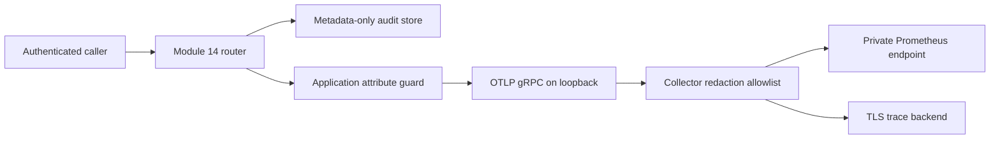

# Module 15: Observability Without Privacy Leakage

## Decision and evidence status

Module 15 adds manual OpenTelemetry metrics and traces to the Module 14 service through an additive
wrapper. The historical Module 14 implementation and MPS evidence remain unchanged. The observed
service is still a research preview in `shadow_review_only` mode: this module does not repair the
failed Module 13 classification and safety-routing gates or approve production use.

The real Apple M4 run emitted all 14 registered metrics and both registered span names for 20
synthetic routes. The in-memory telemetry capture contained only the 15 registered attribute keys;
the customer canaries, request and correlation identifiers, redacted text, matched PII values and
message hashes were absent. This proves the application emission boundary on one Mac. It does not
validate a Collector, Prometheus deployment, trace backend, alert, retention policy or production
data path.

## Data flow and trust boundaries



The application does not use automatic FastAPI instrumentation. It does not accept inbound trace
context or baggage, capture HTTP headers, attach exceptions or stack traces, or emit telemetry
logs. Span names, metric names, routes, methods, actions, devices, error types, processing states,
PII categories and uncertainty buckets all come from fixed vocabularies. Unknown keys or values
fail before an OpenTelemetry instrument is called.

The application can export only to a credential-free HTTP(S) origin. Plaintext OTLP is permitted
only to a loopback Collector; a Linux container must use `127.0.0.1`. Backend credentials belong
to the Collector and are never available to the router process.

## Registered signals

| Signal | Instrument | Dimensions |
|---|---|---|
| Completed requests | Counter | Fixed endpoint, method, status, outcome |
| Request errors | Counter | Fixed endpoint and error category |
| Request latency | Histogram, seconds | Fixed endpoint and outcome |
| Model loading | Histogram, seconds + span | Device, outcome and bounded failure type |
| Selected runtime | Observable gauge | `cpu`, `mps` or `cuda` |
| Routing decisions | Counters | `human_review` or `security_queue` |
| PII redactions | Counter | Registered detector category only; never the match |
| Uncertainty | Histogram + trace bucket | Score distribution; no per-request identifier |
| Routing distribution | Rolling gauges | Review ratio, security ratio, window size and shift |
| HTTP work | Span | Fixed route and method; status and bounded outcome |

Model, routing-policy and service versions are fixed resource attributes. Exact predicted intents
are deliberately excluded: 77 intent labels would add diagnostic value, but they can reveal
sensitive issue types and create a wider data-governance surface. Per-intent analysis remains in
offline, access-controlled evaluation artifacts.

Routing change is total-variation distance over the last 100 governed actions, compared with the
six synthetic Module 10 integration actions. It is suppressed until 20 actions exist. That
reference is not representative of live banking traffic, so no alert threshold is approved.

## Defence in depth

`configs/observability.yaml` is strict and hash-bound. It registers every instrument, attribute,
deployment profile and privacy claim. The Python guard rejects free-form attributes and
unregistered values. The Collector then applies a second fail-closed attribute allowlist before
metrics or traces reach an exporter. Redaction summaries are silent because even a list of removed
keys can reveal implementation detail.

The Collector redaction processor is an additional control, not the primary control. Its metrics
support is currently marked alpha and trace support beta, so pin and validate an exact Collector
image before deployment. See the official [OpenTelemetry sensitive-data guidance](https://opentelemetry.io/docs/security/handling-sensitive-data/)
and [Collector redaction processor](https://github.com/open-telemetry/opentelemetry-collector-contrib/blob/main/processor/redactionprocessor/README.md).

## Native Mac/MPS development

Use an exact, reviewed `otelcol-contrib` release. Start the loopback-only development Collector:

```bash
otelcol-contrib --config deploy/observability/collector-local.yaml
```

The local profile exposes Prometheus-format metrics only on `127.0.0.1:9464`; traces pass through
the redaction allowlist and then go to the no-operation exporter. In another terminal:

```bash
export OTEL_EXPORTER_OTLP_ENDPOINT=http://127.0.0.1:4317
export GOVERNED_BANKING_DEV_API_TOKEN="$(openssl rand -hex 32)"
python scripts/run_deployment_api.py \
  --profile configs/deployment/native-mps.yaml
```

If the Collector endpoint is absent or unsafe, startup fails before the API is created. If MPS is
unavailable, model readiness fails without CPU fallback.

## Container and Kubernetes templates

The CPU and CUDA images now launch
`governed_banking.observed_deployment_service:create_observed_app_from_environment`. Apply the
observability patch together with the Module 14 router template. Replace every placeholder, embed
the reviewed `deploy/observability/collector.yaml` in the ConfigMap and use immutable image
digests. The patch places the Collector in the same pod, directs router OTLP to loopback, reads the
trace-backend authorization value from a Secret, publishes metrics through a private ClusterIP and
allows port 9464 only from a labelled monitoring namespace.

The Collector's own metrics endpoint must not be internet-facing. The example trace exporter
requires TLS. Validate egress, certificate trust, secret rotation, backend tenancy, retention and
regional data residency in the target environment.

Prometheus recommends request, error and duration measurements for online services and warns
against high-cardinality labels. This implementation records requests at completion and uses only
bounded dimensions. See the official [Prometheus instrumentation guidance](https://prometheus.io/docs/practices/instrumentation/)
and [OpenTelemetry Python manual-instrumentation guidance](https://opentelemetry.io/docs/languages/python/instrumentation/).

## Verification

Run the privacy, service and deployment tests:

```bash
pytest -q \
  tests/test_observability_config.py \
  tests/test_observability.py \
  tests/test_observed_deployment_service.py \
  tests/test_observability_deployment.py \
  tests/test_observability_evidence.py
```

Reproduce the real-MPS application-emission evidence:

```bash
python scripts/run_observability_smoke.py
```

The evidence script uses synthetic PII canaries and an in-memory exporter; nothing is sent to a
Collector or remote backend. Its report is
`reports/observability/module15-native-mps-observability.json`.

## Remaining work before production consideration

- Validate a digest-pinned Collector and backend in an isolated staging environment.
- Define retention, deletion, access control, residency and incident-response ownership.
- Establish a representative, governed routing-distribution baseline.
- Register alert thresholds prospectively and test false-positive/false-negative behaviour.
- Load-test cardinality, export backpressure, Collector failure and backend outage behaviour.
- Decide and test whether telemetry failure is fail-open or fail-closed for each deployment tier.
- Complete Module 16 CI, dependency and supply-chain controls.
- Resolve the failed Module 13 model and safety-routing gates independently of observability.
