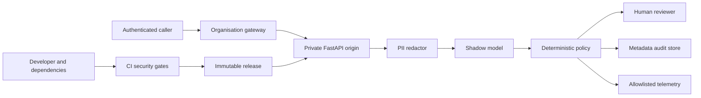

# Governed Banking Intent Router threat model

## Executive summary

The highest risks are unsafe security-request routing, leakage of banking or credential data,
model/configuration integrity compromise and accidental exposure of a research origin service. The
current shadow-review boundary, fail-closed audit path, private-gateway contract and immutable
artifact checks reduce immediate harm, but representative data, real infrastructure and independent
operational evidence are absent. Production use remains prohibited.

## Scope and assumptions

In scope: runtime code under `src/governed_banking/`; registered `configs/`; container, gateway,
Kubernetes and observability templates under `deploy/`; CI workflows; model/data evidence and the
human operational processes in the research-preview governance boundary. Runtime threats are
distinguished from CI/developer
threats and synthetic test inputs.

Confirmed assumptions:

- v0.2.0 is a single-organisation research preview owned by INNETWORK Technology Limited.
- The service remains `shadow_review_only`; every result receives human review.
- Only pinned BANKING77 and labelled synthetic data are permitted; real customer data is prohibited.
- The service is local or a private origin behind an organisation-managed gateway, never a direct
  public endpoint.
- Governance ownership is role-based.
- TF-IDF is champion while LoRA is a non-production shadow challenger.

Out of scope: the security of an unspecified bank/customer-support platform, identity-provider
implementation, cloud account, central audit backend, end-user authentication process and legal or
regulatory compliance assessment. These become in scope before any pilot.

Open questions that would change risk: the selected gateway/identity provider, deployment cloud,
central audit/telemetry services, named role assignments, reviewer capacity and any proposal for
real data, multi-tenancy or public exposure. Each is currently a release blocker rather than an
assumed control.

## System model

### Primary components

- FastAPI entry point and governed service (`src/governed_banking/api.py:create_app`,
  `GovernedService.route`).
- Deployment authentication, capacity, lifecycle and readiness
  (`src/governed_banking/deployment_service.py:create_deployment_app`).
- Structured-PII redactor (`src/governed_banking/privacy.py:redact_pii`).
- Hash-bound LoRA inference adapter (`src/governed_banking/portable_inference.py`).
- Calibration/uncertainty and fail-closed policy (`src/governed_banking/policy.py:route_request`).
- Metadata-only audit boundary (`src/governed_banking/audit.py:build_audit_event`,
  `src/governed_banking/audit_store.py:AuditStore`).
- Privacy-allowlisted telemetry (`src/governed_banking/observability.py`).
- Trusted gateway and private container templates (`deploy/gateway/identity-gateway-contract.yaml`,
  `deploy/kubernetes/router.yaml.template`).
- CI and dependency boundary (`.github/workflows/`, `.github/dependabot.yml`).

### Data flows and trust boundaries

- Caller → local API: message and bearer token over loopback HTTP; bounded JSON, trusted-host and
  bearer validation; TLS is not supplied by the local process (`configs/service.yaml`).
- Authenticated user → organisation gateway: message and OIDC credential over HTTPS; OIDC/TLS and
  global authorization are required but not configured by this repository
  (`deploy/gateway/identity-gateway-contract.yaml`).
- Gateway → private origin: message plus verified identity headers and a rotated origin assertion
  over private HTTP/network; the gateway must strip client-supplied identity headers and be the only
  permitted caller (`deploy/gateway/identity-gateway-contract.yaml:origin_boundary`).
- API → redactor: attacker-controlled text in process memory; type/size/schema and null-byte checks,
  ordered structured detection and residual scan (`src/governed_banking/privacy.py:redact_pii`).
- Redactor → model: transient redacted text; registered model/configuration hashes and offline model
  mode; regex gaps mean residual contextual PII remains possible (`configs/privacy.yaml`,
  `src/governed_banking/portable_inference.py`).
- Model → deterministic policy: label, probabilities and uncertainty metadata in memory; strict
  value validation, security precedence and shadow default (`src/governed_banking/policy.py`).
- Service → audit store: allowlisted categorical/version metadata through an injected append
  protocol; event validation and route rejection on append failure (`src/governed_banking/api.py`,
  `src/governed_banking/audit.py`).
- Service → telemetry backend: fixed metric/span attributes through OTLP; application allowlist and
  Collector redaction, but the external backend is unverified (`configs/observability.yaml`,
  `deploy/observability/collector.yaml`).
- Developer/Dependabot → CI → release artifacts: source and dependency changes enter GitHub-hosted
  jobs; SHA-pinned Actions, least privilege, tests, CodeQL, dependency/secret scanning and SBOM exist,
  while signed release provenance and hash-locked dependencies do not
  (`.github/workflows/quality.yml`, `docs/OPERATIONS.md`).

#### Diagram

## Assets and security objectives

| Asset | Why it matters | Security objective (C/I/A) |
|---|---|---|
| Customer/support message in transient memory | May contain identity, account or credential data | C, I |
| Gateway and development bearer secrets | Protect origin access and caller trust | C, I |
| Model, tokenizer and calibration artifacts | Tampering changes classifications and confidence | I, A |
| Privacy and routing policy | Determines redaction and safety escalation | I, A |
| Champion registry and validation evidence | Supports honest release and model decisions | I |
| Audit events | Support accountability and incident reconstruction | C, I, A |
| Telemetry | Detects failure without retaining customer data | C, I, A |
| Service capacity/readiness | Maintains bounded advisory availability | A |
| CI/release artifacts and dependency graph | A compromised build can subvert every runtime control | I, A |
| Human-review authority and workload | Prevents advisory output becoming an automated decision | I, A |

## Attacker model

### Capabilities

- Submit arbitrary bounded text and malformed JSON to a reachable endpoint.
- Repeat requests, vary identities/headers, probe labels and attempt resource exhaustion.
- Include real or synthetic PII, credentials, prompt-like instructions, ambiguity and multi-intent
  content designed to evade structured redaction or deterministic routing.
- Exploit a misconfigured gateway, leaked assertion/bearer token, vulnerable dependency or
  over-privileged CI workflow.
- A malicious or compromised contributor can propose source, workflow, dependency, model or policy
  changes, but cannot merge to a correctly protected branch without review.

### Non-capabilities

- The remote caller is not assumed to control the private origin network, approved gateway, model
  filesystem, CI repository administration or human-review system.
- The model does not execute prompts, tools, shell commands or transactions; prompt injection here
  can influence classification, not directly execute code.
- The service has no implemented customer database, payment API or automatic retraining channel.
- A normal caller cannot approve a model release or lower risk-policy precedence through the API.

## Entry points and attack surfaces

| Surface | How reached | Trust boundary | Notes | Evidence (repo path / symbol) |
|---|---|---|---|---|
| `POST /v1/route` | Local bearer or private gateway | Caller/gateway → origin | Main untrusted text and availability surface | `src/governed_banking/api.py:create_app`; `deployment_service.py:create_deployment_app` |
| `/health/live`, `/health/ready` | Network probe | Network → origin | Exposes bounded state; readiness protects incomplete load | `src/governed_banking/deployment_service.py` |
| Auth headers/assertion | HTTP headers | Caller/gateway → origin | Header stripping and assertion secrecy are critical | `deploy/gateway/identity-gateway-contract.yaml` |
| YAML configuration | Operator-controlled files | Deployment → process | Strict schemas and hashes; compromised operator/release can change behaviour | `src/governed_banking/deployment_config.py:DeploymentProfile.from_yaml` |
| Model/calibration artifacts | Mounted files | Release store → model process | Integrity-critical, potentially large/untrusted deserialisation surface | `src/governed_banking/portable_inference.py` |
| Audit-store plugin | Injected object/backend | Service → persistence | Must preserve metadata-only schema and availability | `src/governed_banking/audit_store.py:require_audit_store` |
| OTLP endpoint | Environment/config | Service → telemetry backend | Backend trust and transport are operator responsibilities | `src/governed_banking/otel_runtime.py:create_telemetry_runtime` |
| Docker/Kubernetes templates | Operator substitution | Repository → deployment | Placeholder misuse can expose or weaken service | `deploy/docker/`; `deploy/kubernetes/` |
| GitHub pull requests/actions | Contributor/dependency updates | Contributor → CI/release | Workflow and supply-chain compromise surface | `.github/workflows/`; `.github/dependabot.yml` |

## Top abuse paths

1. **Reach the private origin:** attacker discovers an exposed container → bypasses the intended
   gateway → reuses or guesses a static assertion → submits arbitrary messages under forged identity
   → gains unauthorised routing access and consumes capacity.
2. **Leak sensitive content:** caller embeds an identifier not covered by regex → residual value
   reaches the model → future code/plugin records text or unsafe attributes → customer/credential
   data enters audit or telemetry.
3. **Suppress security escalation:** attacker crafts ambiguous, multi-intent or code-switched text →
   LoRA predicts a benign label → uncertainty appears acceptable → reviewer anchors on the model →
   urgent security handling is delayed.
4. **Poison release integrity:** compromised contributor/dependency changes model-loading, privacy or
   workflow code → inadequate review permits merge → altered artifact is built → runtime hashes are
   updated with the malicious revision → controls appear internally consistent.
5. **Exhaust service:** attacker distributes requests across principals → bypasses per-process fixed
   windows → fills inference queue/concurrency → legitimate review requests time out.
6. **Create an evidence blind spot:** attacker or failure disables audit/OTLP backend → repeated
   route attempts create gaps → responders lack complete metadata. Audit fail-closed limits responses
   but can amplify availability loss.
7. **Tamper with local audit evidence:** local process/user gains filesystem access → modifies or
   deletes JSONL events → incident reconstruction and accountability are weakened.
8. **Deploy the template unsafely:** operator replaces placeholders incorrectly or omits private
   network policy/TLS/OIDC → treats a green health check as production readiness → research service
   becomes customer-facing without required controls.

## Threat model table

| Threat ID | Threat source | Prerequisites | Threat action | Impact | Impacted assets | Existing controls (evidence) | Gaps | Recommended mitigations | Detection ideas | Likelihood | Impact severity | Priority |
|---|---|---|---|---|---|---|---|---|---|---|---|---|
| TM-001 | Remote attacker | Origin exposed or gateway assertion leaked/misconfigured | Bypass intended caller boundary and forge identity context | Unauthorised use, capacity loss, misleading audit attribution | Credentials, service, audit | Trusted-gateway mode, issuer allowlist, header-removal contract, private NetworkPolicy template (`deploy/gateway/identity-gateway-contract.yaml`) | No real IdP/gateway test; shared assertion is static bearer material | Keep origin private, use secret manager/rotation, authenticate gateway with mTLS or workload identity, penetration-test header stripping | Alert on origin traffic outside gateway identity/network and assertion failures | Medium under confirmed private assumption | High | High |
| TM-002 | Malicious caller or unsafe code change | Identifier evades structured regex or sink schema is weakened | Cause source/redacted text or credentials to enter model-adjacent stores | Privacy/security incident and possible account harm | Message, credentials, audit, telemetry | Pre-inference redaction/residual scan, audit schema, telemetry allowlist, privacy tests (`privacy.py`, `audit.py`, `observability_config.py`) | Names/contextual IDs missed; no production DLP or real sink inspection | Add production DLP, adversarial privacy corpus, egress/sink schema enforcement and access-controlled retention | Synthetic canaries; prohibited-key detection; audit/telemetry schema alerts | Medium | High | High |
| TM-003 | Adversarial requester | Model sees ambiguous, code-switched or multi-intent text | Induce benign intent for a security-sensitive request | Delayed security assistance; reviewer anchoring | Routing integrity, human oversight | Security-intent/secret precedence, human-review default, no suggestions (`policy.py:route_request`) | Robustness/security gate failed; representative cases absent | Maintain review, add external security corpus, require independent triage and display limitations | Monitor mandatory-case recall, overrides and categorical incident feedback | High | High | High |
| TM-004 | Compromised contributor/dependency | Branch/workflow/release controls bypassed or reviewer compromised | Alter model, privacy, policy, CI or artifact hashes | Systematic hidden misrouting or data leakage | Release artifacts, all runtime controls | SHA-pinned Actions, CodeQL, dependency review, scans, hash checks (`.github/workflows/`, `deployment_config.py`) | No lockfile hashes, signing, provenance attestations or verified branch settings | Protect branches, require CODEOWNERS, lock/hash dependencies, sign artifacts, generate attestations and verify at deploy | Alert on workflow/config changes, failed signatures, unexpected SBOM/hash | Low to medium | High | High |
| TM-005 | Remote attacker | Reachable endpoint and sufficient identities/sources | Flood expensive inference and fill per-process queues | Denial of advisory service and reviewer delay | Availability, human workflow | Body limit, timeouts, bounded queue/concurrency, local rate limiter (`deployment_service.py`) | Limiter is per-process; no verified gateway/global quota or load test | Enforce distributed gateway quota, autoscaling/circuit breakers and registered capacity tests | Queue rejection, timeout, concurrency and latency alerts | Medium | Medium | Medium |
| TM-006 | Attacker or infrastructure failure | Audit/telemetry backend unavailable or compromised | Suppress, poison or delete operational evidence | Detection and forensic gaps; audit failure also denies service | Audit, telemetry, availability | Audit append fail-closed; versioned allowlisted metrics (`api.py`, `observability.py`) | Local JSONL is mutable; real backend/alerts unverified | Append-only/WORM central store, authenticated encrypted export, redundancy and access audit | Missing-event reconciliation, exporter/append failure and version discontinuity alerts | Medium | Medium | Medium |
| TM-007 | Local user/container escape | Filesystem or volume write access | Replace model/config or tamper with audit records | Misrouting, false evidence or lost traceability | Models, policy, audit | Non-root/read-only templates, hashes, immutable revision strategy (`deploy/kubernetes/router.yaml.template`) | Model/audit volumes require writes/trust; runtime signing absent | Separate read-only signed model mount from append-only audit service; least-privilege service account | File-integrity/signature and audit-chain verification | Low under private single-tenant assumption | High | Medium |
| TM-008 | Operator error | Templates treated as deployment-ready | Leave placeholders, expose origin, use mutable image or wrong champion | Broad control bypass or misleading production claim | Service, identity, models, users | Templates declare `production_approved: false`; deployment validation and `docs/OPERATIONS.md` | No admission policy or deployed configuration evidence | Policy-as-code reject placeholders/mutable images/public service; deployment review checklist | CI manifest scan and cluster posture alerts | Medium | High | High |
| TM-009 | Insider or overloaded reviewer | Reviewer access plus weak separation/capacity | Rubber-stamp model output or feed unreviewed corrections into training | Unsafe decisions, bias reinforcement or poisoning | Human decisions, future data/model | Override authority, feedback quarantine, approval roles (`HUMAN_OVERSIGHT.md`, `docs/ARCHITECTURE.md`) | Named assignments, training, workload and independent-review evidence absent | Train reviewers, enforce separation, monitor workload/overrides, approve feedback dataset separately | Override distribution, queue age, reviewer agreement and feedback provenance checks | Medium | High | High |

## Criticality calibration

- **Critical:** credible path to irreversible customer/account harm, large-scale sensitive-data
  exposure or a malicious trusted release with broad reach. Examples: public pre-auth origin control
  leading to real-data exfiltration; compromised signed release used by banks; autonomous model
  output moving or freezing funds. None is ranked critical under the confirmed research boundary;
  public/real-data use would materially raise TM-001–TM-004.
- **High:** likely or material compromise of routing, privacy, identity or release integrity, with
  human/technical controls still capable of containment. Examples: missed security routing,
  contextual PII leakage, forged gateway identity or unsafe template deployment.
- **Medium:** bounded availability/evidence loss or attacks requiring privileged/local access under
  the single-tenant private assumption. Examples: per-process queue exhaustion, local JSONL tamper,
  telemetry outage with audit fail-closed protection.
- **Low:** limited information disclosure or noisy failure with no sensitive content and rapid
  recovery. Examples: unauthenticated liveness discovery on an already private origin, rejected
  malformed JSON, or an unavailable optional development dashboard. Low events can combine into a
  higher-priority abuse path and must still be tracked.

## Focus paths for security review

| Path | Why it matters | Related Threat IDs |
|---|---|---|
| `src/governed_banking/api.py` | Main untrusted-input, redaction, inference and fail-closed audit flow | TM-002, TM-003, TM-006 |
| `src/governed_banking/deployment_service.py` | Authenticator, capacity, lifecycle, headers and readiness | TM-001, TM-005, TM-008 |
| `src/governed_banking/deployment_config.py` | Strict deployment and rollback trust contract | TM-004, TM-008 |
| `src/governed_banking/privacy.py` | Sensitive-data minimisation before model inference | TM-002 |
| `src/governed_banking/policy.py` | Security precedence and shadow fail-closed decision | TM-003 |
| `src/governed_banking/portable_inference.py` | Model/tokenizer loading and artifact/device boundary | TM-004, TM-007 |
| `src/governed_banking/audit.py` | Metadata allowlist and validation | TM-002, TM-006 |
| `src/governed_banking/audit_store.py` | Pluggable persistence trust boundary | TM-006, TM-007 |
| `src/governed_banking/observability.py` | Privacy-safe metric/span construction | TM-002, TM-006 |
| `src/governed_banking/otel_runtime.py` | External exporter endpoint and provider lifecycle | TM-002, TM-006 |
| `deploy/gateway/identity-gateway-contract.yaml` | Identity/header stripping and private-origin assumptions | TM-001, TM-008 |
| `deploy/kubernetes/router.yaml.template` | Network, secret, volume and container security posture | TM-001, TM-007, TM-008 |
| `deploy/docker/` | Base-image and non-root runtime boundary | TM-004, TM-007 |
| `.github/workflows/` | Build, test, scan and artifact supply chain | TM-004 |
| `configs/champion_challenger.yaml` | Prevents silent promotion and records service mismatch | TM-003, TM-004 |

## Notes on use

All discovered runtime entry points, configuration/artifact boundaries, persistence/telemetry exits
and CI inputs are represented above. Runtime, CI/development and tests are separated. The user
confirmed research-only, no-real-data, private-origin, single-organisation, role-based and
champion-mismatch assumptions on 2026-08-21. If any assumption changes, this threat model and risk
ranking require revalidation before implementation or exposure.
